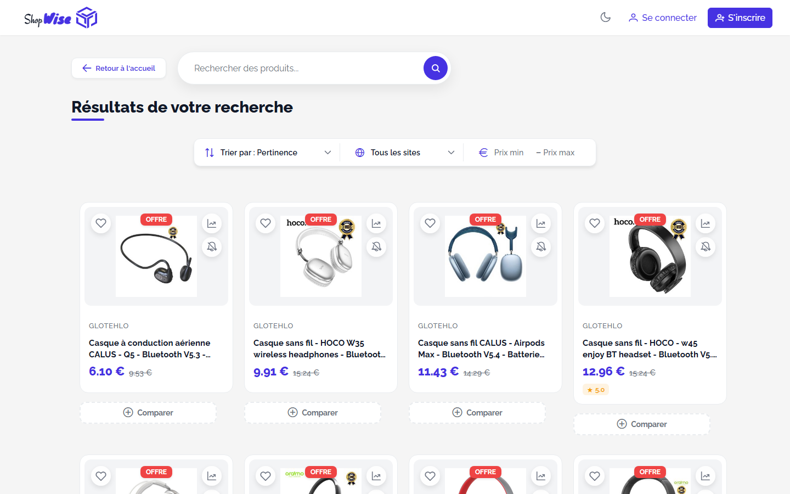
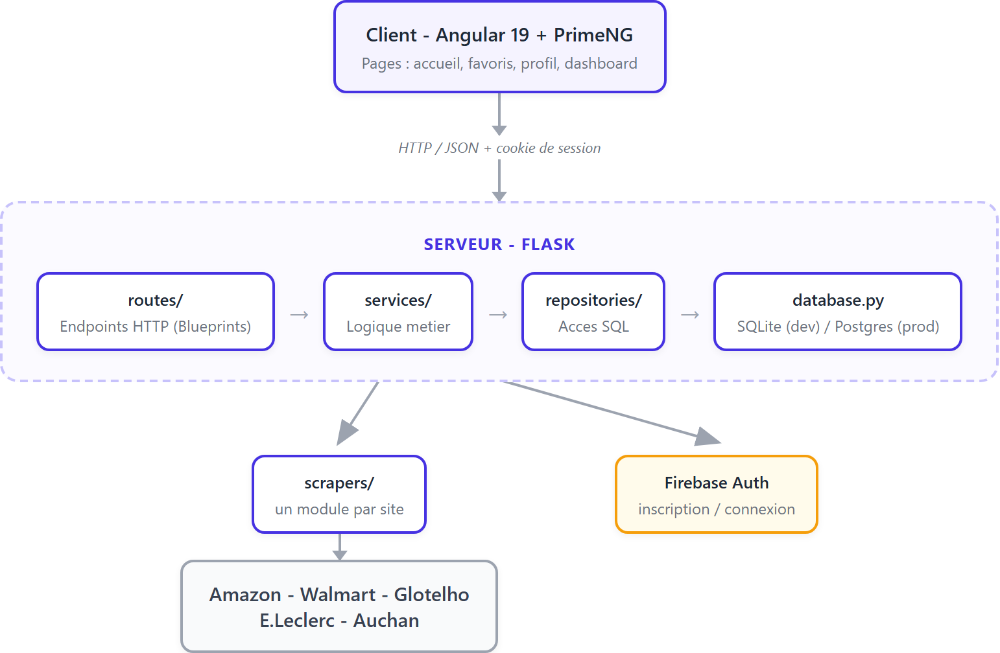

# ShopWise

ShopWise est une application de comparaison de prix multi-enseignes. Elle
recherche un produit simultanément sur plusieurs sites e-commerce, normalise
et déduplique les résultats, puis les affiche côte à côte pour trouver le
meilleur prix. Elle suit aussi l'historique de prix de chaque produit et peut
alerter un utilisateur par email et notification in-app quand le prix d'un
produit suivi baisse.



## Fonctionnalités

- **Recherche multi-enseignes** : Amazon, Glotelho, E.Leclerc, Auchan et
  Materiel.net sont interrogés en parallèle pour chaque recherche, avec un délai
  commun pour qu'un site lent ou bloqué ne retarde jamais les autres.
- **Classement par pertinence** : les résultats sont notés selon la
  correspondance avec les mots-clés, la disponibilité d'une image/d'un prix
  et la popularité, puis triés par pertinence et par prix.
- **Historique de prix** : chaque changement de prix d'un produit est
  enregistré ; un graphique sur la carte produit montre son évolution.
- **Alertes de prix par produit** : un utilisateur peut activer une alerte
  sur un produit précis (avec un seuil de baisse minimal optionnel)
  directement depuis sa carte produit, plutôt que pour une recherche entière.
  Une vérification périodique en arrière-plan envoie un email et/ou une
  notification in-app quand le prix baisse.
- **Favoris et listes personnalisées** : sauvegarder des produits et les
  organiser dans des listes.
- **Historique de recherche** : les recherches récentes sont conservées
  localement par navigateur et peuvent être relancées en un clic (visible
  uniquement pour les utilisateurs connectés).
- **Tableau de bord analytique** : recherches les plus fréquentes,
  statistiques de prix par enseigne, baisses de prix récentes et nombre de
  produits suivis.
- **Authentification** : comptes email/mot de passe via Firebase, avec une
  session gérée côté serveur.

## Architecture

Le client et le serveur sont deux applications indépendantes qui ne
communiquent que par HTTP ; chacune peut être déployée séparément.



Le serveur est lui-même découpé en couches, chacune avec une seule
responsabilité :

- **`routes/`** : un Blueprint Flask par domaine fonctionnel
  (authentification, recherche, favoris, abonnements, profil, listes,
  notifications, analytics, vérification des prix). Une route ne fait que
  traduire une requête HTTP en appel à un service et le résultat en réponse
  JSON ; elle ne contient aucune logique métier et c'est le seul endroit où
  `session`/`request` sont manipulés.
- **`services/`** : la logique métier. `search_service` (orchestration des
  scrapers, cache, calcul de pertinence, persistance du catalogue),
  `price_alert_service` (récupération du prix actuel, logique de seuil,
  envoi des alertes), `auth_service` (fine surcouche autour de Firebase).
  Aucun service n'importe Flask, ce qui les rend testables isolément.
- **`repositories/`** : le seul endroit où du SQL est écrit. Chaque fichier
  gère une table (ou un petit groupe de tables liées) et expose des
  fonctions simples (`get_favorites_by_email`, `upsert_subscription`, ...).
  Aucune logique métier n'y vit.
- **`database.py`** : ouverture de connexion et schéma. Supporte SQLite
  (par défaut, utilisé en local) et Postgres (utilisé en production, via la
  variable d'environnement `DATABASE_URL`) derrière la même interface, pour
  que les repositories n'aient pas à connaître le moteur utilisé.
- **`scrapers/`** : un module par enseigne, chacun exposant une seule
  fonction `scrape_<site>(query)` qui retourne une liste de résultats
  normalisés (titre, prix, image, note, URL du produit, ...).

## Stack technique

| Couche | Technologie |
|---|---|
| Client | Angular 19, PrimeNG, RxJS, Chart.js |
| Serveur | Python, Flask, Flask-CORS, Flask-Limiter |
| Scraping | curl_cffi (impersonation navigateur), BeautifulSoup |
| Base de données | SQLite (développement), Postgres (production) |
| Authentification | Firebase (Pyrebase côté serveur) |
| Planification | APScheduler (vérification périodique des prix) |
| Tests | pytest (serveur), Jasmine/Karma (client) |
| CI | GitHub Actions |
| Déploiement | Docker, Render |

## Structure du projet

```
ShopWise/
├── client/                     Application Angular
│   └── src/app/
│       ├── pages/               accueil, favoris, profil, dashboard
│       └── shareds/             auth, toast, loader, nav, theme
├── server/                     Application Flask
│   ├── app.py                   construit l'app et assemble le tout
│   ├── config.py                toutes les variables d'environnement
│   ├── database.py               connexion + schéma (SQLite/Postgres)
│   ├── extensions.py             extensions Flask partagées (rate limiter)
│   ├── routes/                   endpoints HTTP (Blueprints)
│   ├── services/                 logique métier
│   ├── repositories/             accès SQL
│   ├── scrapers/                 un module par enseigne
│   ├── utils.py                  utilitaires de parsing/formatage partagés
│   └── test_*.py                 suite pytest
├── render.yaml                  blueprint de déploiement Render
└── .github/workflows/           CI (serveur et client)
```

## Démarrage

### Prérequis

- Node.js 20+ et npm (client)
- Python 3.11+ (serveur)

### Serveur

```bash
cd server
python -m venv venv
venv\Scripts\activate       # sous Windows ; `source venv/bin/activate` sous macOS/Linux
pip install -r requirements.txt
```

Créer un fichier `.env` dans `server/` avec au minimum la configuration
Firebase (nécessaire pour que l'inscription/connexion fonctionne) :

```
FIREBASE_API_KEY=...
FIREBASE_AUTH_DOMAIN=...
FIREBASE_PROJECT_ID=...
FIREBASE_STORAGE_BUCKET=...
FIREBASE_MESSAGING_SENDER_ID=...
FIREBASE_APP_ID=...
FIREBASE_DATABASE_URL=...
FLASK_SECRET_KEY=une-chaine-aleatoire
```

Les variables SMTP (`SMTP_SERVER`, `SMTP_PORT`, `SMTP_USERNAME`,
`SMTP_PASSWORD`, `SMTP_FROM_EMAIL`) sont optionnelles : sans elles, les
emails de baisse de prix sont simplement ignorés, mais les notifications
in-app continuent de fonctionner. `DATABASE_URL` est optionnelle aussi :
l'omettre pour utiliser un fichier SQLite local.

Lancer le serveur :

```bash
python app.py
```

L'API écoute sur `http://localhost:5000`.

### Client

```bash
cd client
npm install
npm start
```

L'application est servie sur `http://localhost:4200` et s'attend à ce que
le serveur tourne sur `http://localhost:5000` (configuré dans
`client/src/environments/environment.ts`).

## Tests

```bash
# Serveur (pytest)
cd server
pytest -v

# Client (Karma/Jasmine)
cd client
npm test
```

Les deux suites tournent automatiquement à chaque push/PR via GitHub Actions
(`.github/workflows/server-tests.yml` et `client-tests.yml`).

## Déploiement

`render.yaml` définit un Blueprint Render : un service web Docker pour le
serveur, un site statique pour le client, et une base Postgres gratuite,
reliés entre eux par des variables d'environnement. Les secrets (Firebase,
SMTP) sont volontairement absents du blueprint et doivent être renseignés
manuellement depuis le dashboard Render une fois le blueprint appliqué. Voir
les commentaires en tête de `render.yaml` pour la marche à suivre exacte.
