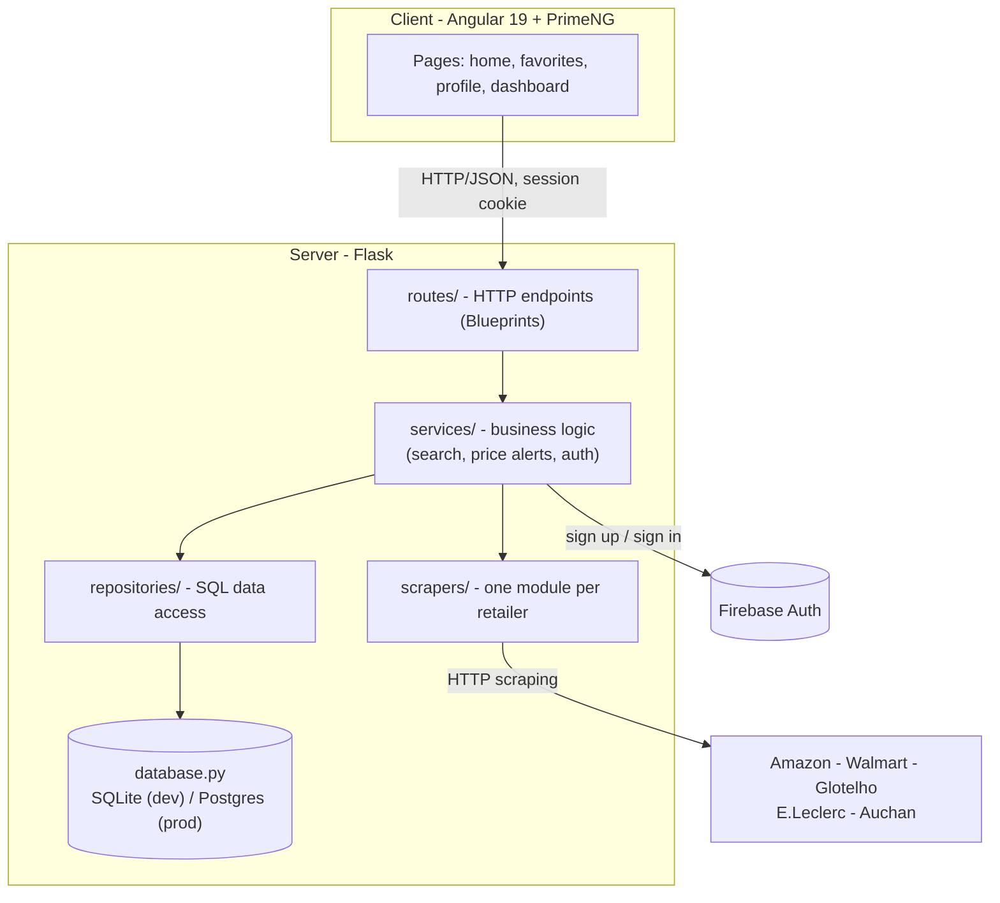

# ShopWise

ShopWise is a multi-retailer price comparison app. It searches several
e-commerce sites in parallel for a given product, normalizes and deduplicates
the results, and shows them side by side so you can find the best price. It
also tracks price history per product and can alert a user by email and
in-app notification when the price of a product they follow drops.


## Features

- **Multi-retailer search**: Amazon, Walmart, Glotelho, E.Leclerc and Auchan
  are scraped in parallel for each query, with a shared timeout so one slow
  or blocked site never delays the others.
- **Relevance ranking**: results are scored on keyword match, image/price
  availability and popularity, then sorted by relevance and price.
- **Price history**: every time a product's price changes, a new data point
  is recorded; a chart on each product card shows the trend over time.
- **Per-product price alerts**: users can turn on an alert for a specific
  product (with an optional minimum drop percentage) directly from its
  product card, rather than for an entire search. A background job checks
  subscribed products periodically and sends an email and/or in-app
  notification when the price drops.
- **Favorites and personal lists**: save products and organize them into
  custom lists.
- **Search history**: recent searches are kept locally per browser and can
  be replayed with one click (only shown to signed-in users).
- **Analytics dashboard**: most frequent searches, price statistics per
  retailer, recent price drops and tracked-product counts.
- **Authentication**: email/password accounts via Firebase, with a
  server-side session cookie.

## Architecture

The client and server are independent applications that only communicate
over HTTP; either can be deployed on its own.



The server itself is layered so that each part has one job:

- **`routes/`** - one Flask Blueprint per functional area (auth, search,
  favorites, subscriptions, profile, lists, notifications, analytics,
  price-check). Routes only translate HTTP requests into service calls and
  service results into JSON responses; they contain no business logic and
  are the only place session/request objects are touched.
- **`services/`** - the business logic: `search_service` (scraper
  orchestration, caching, relevance scoring, catalog persistence),
  `price_alert_service` (current-price lookup, threshold logic, sending
  alerts), `auth_service` (a thin wrapper around Firebase). Services never
  import Flask and can be unit-tested in isolation.
- **`repositories/`** - the only place SQL is written. Each file owns one
  table (or a small group of related tables) and exposes plain functions
  (`get_favorites_by_email`, `upsert_subscription`, ...). No business logic
  lives here.
- **`database.py`** - connection handling and schema. Supports SQLite
  (default, used locally) and Postgres (used in production, selected via
  the `DATABASE_URL` environment variable) behind the same interface, so
  repositories don't need to know which one is active.
- **`scrapers/`** - one module per retailer, each exposing a single
  `scrape_<site>(query)` function that returns a normalized list of
  records (title, price, image, rating, product URL, ...).

## Tech stack

| Layer | Technology |
|---|---|
| Client | Angular 19, PrimeNG, RxJS, Chart.js |
| Server | Python, Flask, Flask-CORS, Flask-Limiter |
| Scraping | curl_cffi (browser impersonation), BeautifulSoup |
| Database | SQLite (development), Postgres (production) |
| Auth | Firebase (Pyrebase on the server) |
| Scheduling | APScheduler (periodic price checks) |
| Testing | pytest (server), Jasmine/Karma (client) |
| CI | GitHub Actions |
| Deployment | Docker, Render |

## Project structure

```
ShopWise/
├── client/                     Angular application
│   └── src/app/
│       ├── pages/               home, favorites, profile, dashboard
│       └── shareds/             auth, toast, loader, nav, theme
├── server/                     Flask application
│   ├── app.py                   builds the app, wires everything together
│   ├── config.py                all environment variables read here
│   ├── database.py               connection handling + schema (SQLite/Postgres)
│   ├── extensions.py             shared Flask extensions (rate limiter)
│   ├── routes/                   HTTP endpoints (Blueprints)
│   ├── services/                 business logic
│   ├── repositories/             SQL data access
│   ├── scrapers/                 one module per retailer
│   ├── utils.py                  shared parsing/formatting helpers
│   └── test_*.py                 pytest suite
├── render.yaml                  Render deployment blueprint
└── .github/workflows/           CI (server and client)
```

## Getting started

### Prerequisites

- Node.js 20+ and npm (client)
- Python 3.11+ (server)

### Server

```bash
cd server
python -m venv venv
venv\Scripts\activate       # on Windows; use `source venv/bin/activate` on macOS/Linux
pip install -r requirements.txt
```

Create a `.env` file in `server/` with at least the Firebase configuration
(required for sign up/sign in to work):

```
FIREBASE_API_KEY=...
FIREBASE_AUTH_DOMAIN=...
FIREBASE_PROJECT_ID=...
FIREBASE_STORAGE_BUCKET=...
FIREBASE_MESSAGING_SENDER_ID=...
FIREBASE_APP_ID=...
FIREBASE_DATABASE_URL=...
FLASK_SECRET_KEY=some-random-string
```

SMTP variables (`SMTP_SERVER`, `SMTP_PORT`, `SMTP_USERNAME`, `SMTP_PASSWORD`,
`SMTP_FROM_EMAIL`) are optional; without them, price-drop emails are skipped
but in-app notifications still work. `DATABASE_URL` is optional too - omit it
to use a local SQLite file.

Run the server:

```bash
python app.py
```

The API listens on `http://localhost:5000`.

### Client

```bash
cd client
npm install
npm start
```

The app is served on `http://localhost:4200` and expects the server to be
running on `http://localhost:5000` (configured in
`client/src/environments/environment.ts`).

## Testing

```bash
# Server (pytest)
cd server
pytest -v

# Client (Karma/Jasmine)
cd client
npm test
```

Both suites run automatically on push/PR via GitHub Actions
(`.github/workflows/server-tests.yml` and `client-tests.yml`).

## Deployment

`render.yaml` defines a Render Blueprint: a Docker web service for the
server, a static site for the client, and a free Postgres database, wired
together with environment variables. Secrets (Firebase, SMTP) are left
unset in the blueprint and must be filled in manually from the Render
dashboard after applying it. See the comments at the top of `render.yaml`
for the exact steps.
